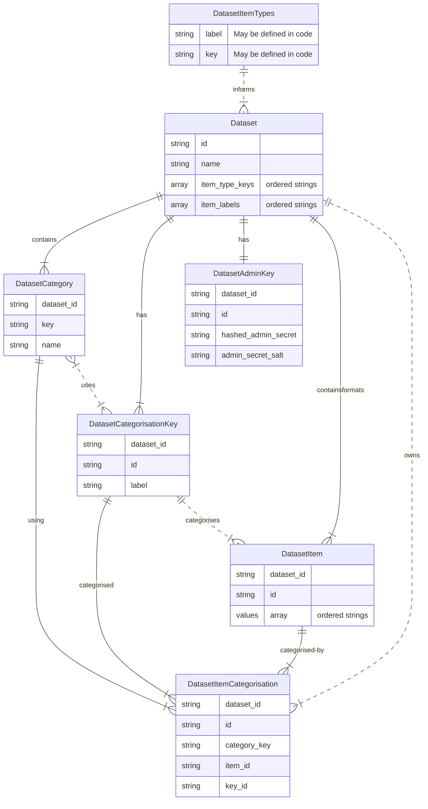

# quickcategory

Application for quickly categorising data

## The Data Model

This initial version is built around the idea of "anon" users

```mermaid
erDiagram
  DatasetItemTypes {
    string label "May be defined in code"
    string key "May be defined in code"
  }
  DatasetAdminKey {
    string dataset_id
    string id
    string hashed_admin_secret
    string admin_secret_salt
  }
  DatasetCategorisationKey {
    string dataset_id
    string id
    string label
  }
  Dataset {
    string id
    string name
    array item_type_keys "ordered strings"
    array item_labels "ordered strings"
  }
  DatasetCategory {
    string dataset_id
    string key
    string name
  }
  DatasetItemCategorisation {
    string dataset_id
    string id
    string category_key
    string item_id
    string key_id
  }
  DatasetItem {
    string dataset_id
    string id
    values array "ordered strings"
  }
  Dataset ||--|{ DatasetCategory : contains
  Dataset ||--|{ DatasetCategorisationKey : has
  Dataset ||--|| DatasetAdminKey : has
  Dataset ||--|{ DatasetItem : containsformats
  Dataset ||..|{ DatasetItemCategorisation : owns
  DatasetItem ||--|{ DatasetItemCategorisation : categorised-by
  DatasetCategory ||--|{ DatasetItemCategorisation : using
  DatasetCategorisationKey ||--|{ DatasetItemCategorisation : categorised
  DatasetItemTypes ||..|{ Dataset : informs
  DatasetCategory }|..|{ DatasetCategorisationKey : uses
  DatasetCategorisationKey ||..|{ DatasetItem : categorises
```
