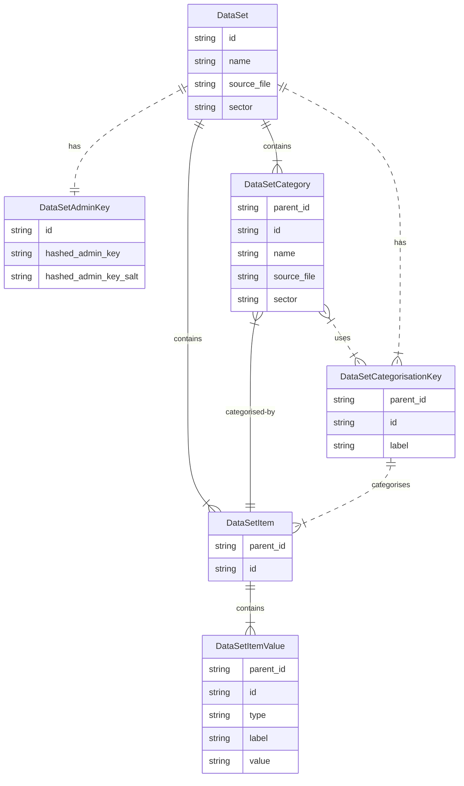

# quickcategory

Application for quickly categorising data

## The Data Model

This whole thing is built around neo4j - so need to have some deep thinking on the model.

This initial version is built around the idea of "anon" users

